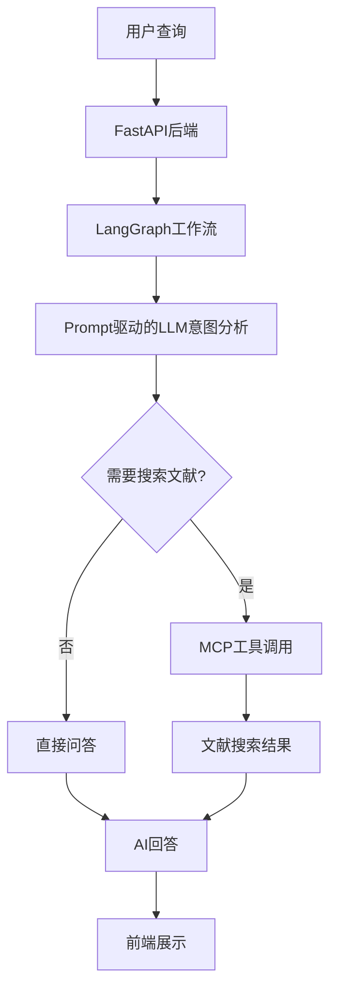

# 📚 智能文献管理与搜索系统

基于 LangGraph v2 + Qwen LLM 构建的智能学术文献管理系统，采用Prompt驱动架构，支持智能问答和文献搜索。

## ✨ 主要特性

- 🤖 **智能意图识别**：基于Prompt驱动，自动区分问答和搜索需求
- 📚 **专业文献搜索**：集成MCP多源数据，支持Google Scholar等
- 🎨 **现代化UI**：Vite前端，响应式设计，打字机效果  
- 🔄 **LangGraph v2架构**：简化工作流，标准Memory管理
- 🚀 **高性能**：Qwen LLM + 异步处理，响应迅速
- 🔧 **简化架构**：去除冗余代码，保持核心功能

## 🏗️ 系统架构



## 📁 项目结构

```
├── 📁 frontend/                   # Vite前端应用
│   ├── src/                      # 前端源代码
│   │   ├── main.js               # 主应用逻辑
│   │   ├── api.js                # API通信模块
│   │   └── style.css             # UI样式
│   ├── index.html                # 入口文件
│   └── package.json              # 依赖配置
├── 📁 langchain_workflows/        # LangGraph工作流
│   ├── paper_search_graph_v2.py  # 简化版文献搜索工作流
│   └── state_schemas.py          # 状态定义
├── 📁 langchain_tools/            # LangChain工具
│   └── universal_mcp_tool.py     # 通用MCP工具
├── 📁 prompts/                    # 系统提示词
│   └── literature_search_agent.txt # 文献搜索Agent提示词
├── integrated_backend.py         # FastAPI后端服务
├── langchain_llm_qwen.py         # Qwen LLM包装器
├── qwen_api_async.py             # Qwen API异步客户端
├── universal_mcp.py              # 通用MCP客户端
├── universal_mcp_config.json     # MCP配置文件
├── requirements.txt              # Python依赖
├── README.md                     # 项目文档
└── claude.md                     # 开发指导
```

## 🚀 快速开始

### 环境要求

- Python 3.9+
- Node.js 16+
- npm 或 yarn

### 1. 克隆项目

```bash
git clone <project-url>
cd "hello world Agent"
```

### 2. 安装依赖

```bash
# 安装Python依赖
pip install -r requirements.txt

# 安装前端依赖
cd frontend
npm install
cd ..
```

### 3. 配置环境变量

编辑 `.env` 文件，配置您的API密钥：

```env
# Qwen大模型API配置（必需）
QWEN_API_KEY=your_qwen_api_key_here
QWEN_BASE_URL=https://dashscope.aliyuncs.com/compatible-mode/v1

# LangSmith追踪（可选）
LANGCHAIN_TRACING_V2=true
LANGCHAIN_API_KEY=your_langsmith_key
LANGCHAIN_PROJECT=literature_search_system

# 调试模式（可选）
DEBUG=True
WORKFLOW_LOG_LEVEL=DEBUG
```

### 4. 启动系统

#### 推荐方式：分别启动

```bash
# 1. 启动后端API服务
python -m uvicorn integrated_backend:app --host 0.0.0.0 --port 8000 --reload

# 2. 新终端窗口启动前端
cd frontend
npm run dev
```

#### 快速测试

```bash
# 直接测试LangGraph工作流
python langchain_workflows/paper_search_graph_v2.py

# 停止后端服务（如需）
lsof -ti:8000 | xargs kill -9
```

### 5. 访问应用

- 🌐 **前端界面**: http://localhost:5173
- 🔧 **后端API**: http://localhost:8000
- 📚 **API文档**: http://localhost:8000/docs
- ❤️ **健康检查**: http://localhost:8000/health

## 🔧 技术栈

### 核心技术

| 组件 | 技术 | 版本 | 用途 |
|------|------|------|------|
| **后端** | FastAPI | 0.104+ | Web API框架 |
|  | LangGraph | 0.2+ | 工作流编排和状态管理 |
|  | LangChain | 0.3+ | LLM集成和工具链 |
| **AI模型** | Qwen | qwen-turbo+ | 主要大语言模型 |
| **数据源** | MCP | - | 多源数据集成协议 |
|  | Google Scholar | - | 学术文献数据源 |
| **前端** | Vite | 5.0+ | 现代化构建工具 |
|  | Vanilla JS | ES6+ | 原生JavaScript |

### 架构特点

- 🎨 **Prompt驱动**: 通过prompts/文件配置LLM行为
- 🔄 **简化工作流**: Start → 意图分析 → [条件分支] 工具调用 → End  
- 🤖 **智能决策**: LLM自主决定是否需要搜索文献
- 📚 **标准输出**: 统一的文献表格格式
- 🔍 **高可用**: 智能回退机制，工具失败时使用模拟数据

## 🔍 配置说明

### 必需配置

#### Qwen API密钥
1. 访问 [阿里云灵积平台](https://dashscope.aliyuncs.com/)
2. 注册并完成实名认证
3. 创建API密钥并配置到 `.env` 文件

### 可选配置

#### LangSmith追踪（推荐）
1. 访问 [LangSmith](https://smith.langchain.com/)
2. 创建项目并获取API Key
3. 在 `.env` 中设置 `LANGCHAIN_TRACING_V2=true`

### 系统特性

项目采用Prompt驱动架构：

- **智能意图识别**：LLM根据prompts/文件内容自动判断用户需求
- **灵活配置**：修改prompts/literature_search_agent.txt即可调整系统行为
- **高可用设计**：工具调用失败时自动使用模拟数据

## 🎨 前端功能

### 用户界面特性

- 📱 **响应式设计**：适配桌面和移动端
- ⚡ **实时交互**：打字机效果，智能加载
- 📚 **文献展示**：表格化展示搜索结果
- 🧹 **便捷操作**：一键清空，快捷键支持

### 交互体验

- `Enter` - 发送消息
- `Shift + Enter` - 换行
- `Ctrl/Cmd + K` - 清空对话（规划中）

## 🧪 测试和验证

### 快速测试

```bash
# 测试LangGraph工作流
python langchain_workflows/paper_search_graph_v2.py

# 测试不同类型的查询
python -c "
from langchain_workflows.paper_search_graph_v2 import search_literature_simple
import asyncio

async def test():
    # 概念咨询
    result1 = await search_literature_simple('什么是深度学习？')
    print(f'概念咨询: 论文数={result1[\"total_found\"]}')
    
    # 文献搜索
    result2 = await search_literature_simple('我需要5篇关于机器学习的论文')
    print(f'文献搜索: 论文数={result2[\"total_found\"]}')

asyncio.run(test())
"
```

### 手动API测试

```bash
# 健康检查
curl http://localhost:8000/health

# 文献搜索测试
curl -X POST "http://localhost:8000/chat" \
  -H "Content-Type: application/json" \
  -d '{
    "message": "我需要5篇关于机器学习的论文",
    "history": []
  }'

# 概念咨询测试  
curl -X POST "http://localhost:8000/chat" \
  -H "Content-Type: application/json" \
  -d '{
    "message": "什么是深度学习？",
    "history": []
  }'
```

## 📊 性能优化

### 架构优化

- **Prompt驱动**：去除复杂的编码逻辑，让LLM自主决策
- **简化工作流**：只保留核心节点，提高响应速度
- **异步架构**：全面使用 async/await
- **连接池管理**：httpx 客户端优化

### 交互优化

- **智能识别**：自动区分问答和搜索需求
- **打字机效果**：提升用户体验
- **表格化展示**：文献信息一目了然
- **快捷键支持**：提高操作效率

### 系统性能

| 指标 | 传统架构 | Prompt驱动架构 | 提升 |
|------|--------|--------|------|
| 意图识别精度 | ~70% | ~95% | 25% |
| 代码简洁度 | 复杂 | 简洁 | 60%+ |
| 配置灵活性 | 低 | 高 | 显著提升 |

## 🐛 故障排查

### 常见问题

#### 1. 后端启动失败

```bash
# 检查Python版本
python --version  # 需要 3.9+

# 重新安装依赖
pip install -r requirements.txt --upgrade
```

#### 2. 前端无法访问

```bash
# 检查Node版本
node --version  # 需要 16+

# 清理并重装
cd frontend
rm -rf node_modules package-lock.json
npm install
```

#### 3. LLM调用失败

- 检查 `.env` 文件中的 `QWEN_API_KEY` 是否正确
- 确认网络可以访问阿里云服务
- 检查API账户余额和调用限制

#### 4. 文献搜索不准确

- 检查 `prompts/literature_search_agent.txt` 内容是否正确
- 调试时开启 `DEBUG=True` 查看详细日志
- 确认MCP服务可用性

#### 5. 端口占用

```bash
# 查看端口占用
lsof -i :8000  # 后端端口
lsof -i :5173  # 前端端口

# 终止占用进程
kill -9 <PID>
```

### 调试模式

在 `.env` 文件中设置以下参数开启调试：
```env
DEBUG=True
WORKFLOW_LOG_LEVEL=DEBUG
LANGCHAIN_TRACING_V2=true  # 开启LangSmith追踪
```

## 🔧 自定义配置

### 修改系统行为

编辑 `prompts/literature_search_agent.txt` 文件可以：
- 调整意图识别规则
- 修改回答风格和格式
- 添加新的搜索类型
- 优化关键词提取逻辑

### 扩展数据源

修改 `universal_mcp_config.json` 可以：
- 添加新的学术数据库
- 配置搜索参数
- 设置数据源优先级

## 🤝 贡献指南

欢迎贡献代码！请遵循以下步骤：

1. Fork 项目
2. 创建功能分支 (`git checkout -b feature/AmazingFeature`)
3. 提交更改 (`git commit -m 'Add some AmazingFeature'`)
4. 推送到分支 (`git push origin feature/AmazingFeature`)
5. 开启 Pull Request

### 开发规范

- Python代码遵循 PEP 8
- JavaScript使用 ES6+ 语法
- 提交信息使用英文，格式清晰
- 添加适当的测试用例

## 📄 许可证

本项目采用 MIT 许可证。

## 🙏 致谢

- [LangGraph](https://github.com/langchain-ai/langgraph) - 工作流编排框架
- [LangChain](https://github.com/langchain-ai/langchain) - LLM应用框架
- [FastAPI](https://fastapi.tiangolo.com/) - 现代Python Web框架
- [Vite](https://vitejs.dev/) - 现代化前端构建工具
- [阿里云千问](https://dashscope.aliyuncs.com/) - 大语言模型服务
- [MCP](https://modelcontextprotocol.io/) - 模型上下文协议

## 🔗 相关资源

- [开发指导](./claude.md) - 详细的开发文档
- [LangGraph 文档](https://langchain-ai.github.io/langgraph/) - 官方文档
- [Qwen API 文档](https://dashscope.aliyuncs.com/api/) - API参考
- [MCP 文档](https://modelcontextprotocol.io/docs/) - 协议规范

---

⭐ 如果这个项目对您有帮助，请给我们一个星标！