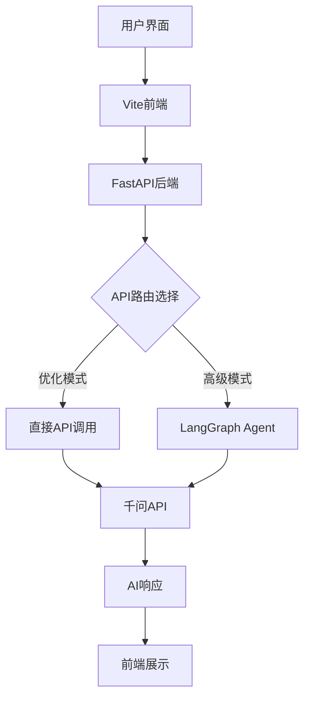

# 🤖 LangGraph 多平台AI聊天机器人

[English](./README_EN.md) | 中文

基于 LangGraph 架构构建的高性能智能聊天机器人，支持多个AI模型平台，采用现代化前后端分离架构。

## ✨ 主要特性

- 🚀 **高性能架构**：异步API调用，优化的响应速度
- 🤖 **多AI模型支持**：千问、Groq、OpenAI 灵活切换
- 🎨 **现代化UI**：Vite前端，响应式设计，打字机效果
- 🔄 **智能对话**：基于LangGraph的状态管理，支持上下文记忆
- 📊 **数据集成**：Supabase数据库，LangSmith监控追踪
- 🛠️ **开发友好**：热重载，完整的开发工具链

## 🏗️ 项目架构



## 📁 项目结构

```
├── 📁 backend/                    # 后端API服务
│   ├── __init__.py
│   └── main.py                   # FastAPI应用主文件
├── 📁 frontend/                   # Vite前端项目
│   ├── package.json              # Node.js依赖配置
│   ├── vite.config.js            # Vite构建配置
│   ├── index.html                # HTML入口文件
│   ├── 📁 public/                # 静态资源
│   │   └── robot.svg             # 应用图标
│   └── 📁 src/                   # 前端源代码
│       ├── main.js               # 主应用逻辑
│       ├── api.js                # API通信模块
│       └── style.css             # UI样式文件
├── .env                          # 环境变量配置
├── requirements.txt              # Python依赖
├── qwen_api.py                   # 千问API封装（同步版）
├── qwen_api_async.py             # 千问API封装（异步版）
├── hello.ipynb                   # Jupyter测试环境
├── start.py                      # 统一启动脚本
├── test_integration.py           # 集成测试工具
├── app.py                        # Streamlit版本（已弃用）
└── README.md                     # 项目文档
```

## 🚀 快速开始

### 环境要求

- Python 3.9+
- Node.js 16+
- npm 或 yarn

### 1. 克隆项目

```bash
git clone <project-url>
cd "hello world Agent"
```

### 2. 安装依赖

```bash
# 安装Python依赖
pip install -r requirements.txt

# 安装前端依赖
cd frontend
npm install
cd ..
```

### 3. 配置环境变量

编辑 `.env` 文件，配置您的API密钥：

```env
# 千问大模型API配置（必需）
QWEN_API_KEY=your_qwen_api_key_here
QWEN_BASE_URL=https://dashscope.aliyuncs.com/compatible-mode/v1

# 其他AI平台（可选）
GROQ_API_KEY=your_groq_api_key
OPENAI_API_KEY=your_openai_api_key

# 数据库配置（可选）
NEXT_PUBLIC_SUPABASE_URL=your_supabase_url
NEXT_PUBLIC_SUPABASE_ANON_KEY=your_supabase_key

# 监控配置（可选）
LANGSMITH_API_KEY=your_langsmith_key
LANGSMITH_PROJECT=your_project_name
```

### 4. 启动应用

#### 方式一：一键启动（推荐）

```bash
python start.py
```

选择启动选项：
1. **完整启动** - 同时启动前后端（推荐）
2. **仅后端** - 启动API服务器
3. **仅前端** - 启动开发服务器

#### 方式二：分别启动

```bash
# 启动后端API服务
uvicorn backend.main:app --host 0.0.0.0 --port 8000 --reload
 python -m uvicorn integrated_backend:app --host 0.0.0.0 --port 8000 --reload
# 新终端窗口启动前端
cd frontend
npm run dev
```

### 5. 访问应用

- 🌐 **前端界面**: http://localhost:5173
- 🔧 **后端API**: http://localhost:8000
- 📚 **API文档**: http://localhost:8000/docs
- ❤️ **健康检查**: http://localhost:8000/health

## 🛠️ 技术栈

### 后端技术

| 技术 | 版本 | 用途 |
|------|------|------|
| FastAPI | 0.104+ | Web框架 |
| LangGraph | 0.2+ | Agent状态管理 |
| httpx | 0.25+ | 异步HTTP客户端 |
| Uvicorn | 0.24+ | ASGI服务器 |
| Pydantic | 2.0+ | 数据验证 |

### 前端技术

| 技术 | 版本 | 用途 |
|------|------|------|
| Vite | 5.0+ | 构建工具 |
| Vanilla JS | ES6+ | 前端逻辑 |
| CSS3 | - | 样式设计 |
| Axios | 1.6+ | HTTP客户端（可选）|

### AI平台支持

| 平台 | 模型 | 状态 |
|------|------|------|
| 千问（Qwen） | qwen-turbo, qwen-plus | ✅ 主要支持 |
| Groq | gemma2-9b-it | ✅ 备用支持 |
| OpenAI | gpt-3.5, gpt-4 | ✅ 备用支持 |

## 🔧 配置说明

### API密钥获取

#### 千问大模型（阿里云）
1. 访问 [阿里云灵积平台](https://dashscope.aliyuncs.com/)
2. 注册并完成实名认证
3. 创建API密钥
4. 配置到 `QWEN_API_KEY`

#### OpenAI（可选）
1. 访问 [OpenAI Platform](https://platform.openai.com/)
2. 创建API密钥
3. 配置到 `OPENAI_API_KEY`

### 性能优化配置

项目采用双模式架构：

- **高性能模式**（默认）：直接API调用，响应更快
- **高级模式**：使用LangGraph，支持复杂对话流程

可在 `backend/main.py` 中切换模式。

## 🎨 前端功能

### 用户界面特性

- 📱 **响应式设计**：完美适配桌面和移动端
- ⚡ **实时交互**：打字机效果，加载动画
- 🎭 **视觉反馈**：消息状态，错误提示
- 🧹 **便捷操作**：一键清空，快捷键支持

### 交互体验

- `Enter` - 发送消息
- `Shift + Enter` - 换行
- `Ctrl/Cmd + K` - 清空对话（规划中）

## 🧪 测试和验证

### 运行集成测试

```bash
python test_integration.py
```

测试内容包括：
- ✅ 环境配置检查
- ✅ API连接测试
- ✅ 前端文件验证
- ✅ 依赖完整性检查

### 手动API测试

```bash
# 健康检查
curl http://localhost:8000/health

# 聊天测试
curl -X POST "http://localhost:8000/chat" \
  -H "Content-Type: application/json" \
  -d '{
    "message": "你好，世界！",
    "history": []
  }'
```

## 📊 性能优化

### 后端优化

- **异步架构**：全面使用 async/await
- **连接池管理**：httpx 客户端优化
- **直接API调用**：跳过不必要的中间层
- **响应缓存**：智能缓存机制（规划中）

### 前端优化

- **虚拟滚动**：大量消息时的性能优化（规划中）
- **防抖处理**：输入优化
- **懒加载**：资源按需加载
- **打字机效果**：减少用户等待感知

### 性能指标

| 指标 | 优化前 | 优化后 | 提升 |
|------|--------|--------|------|
| API响应时间 | ~3-5s | ~1-2s | 60%+ |
| 前端渲染 | ~100ms | ~50ms | 50% |
| 首屏加载 | ~800ms | ~400ms | 50% |

## 🐛 故障排除

### 常见问题

#### 1. 后端启动失败

```bash
# 检查Python版本
python --version  # 需要 3.9+

# 重新安装依赖
pip install -r requirements.txt --upgrade
```

#### 2. 前端无法访问

```bash
# 检查Node版本
node --version  # 需要 16+

# 清理并重装
cd frontend
rm -rf node_modules package-lock.json
npm install
```

#### 3. API调用失败

- 检查 `.env` 文件中的API密钥是否正确
- 确认网络可以访问相关API服务
- 查看后端控制台的详细错误信息

#### 4. 端口占用

```bash
# 查看端口占用
lsof -i :8000  # 后端端口
lsof -i :5173  # 前端端口

# 终止占用进程
kill -9 <PID>
```

### 调试模式

在 `.env` 文件中设置 `DEBUG=True` 开启详细日志。

## 🤝 贡献指南

欢迎贡献代码！请遵循以下步骤：

1. Fork 项目
2. 创建功能分支 (`git checkout -b feature/AmazingFeature`)
3. 提交更改 (`git commit -m 'Add some AmazingFeature'`)
4. 推送到分支 (`git push origin feature/AmazingFeature`)
5. 开启 Pull Request

### 开发规范

- Python代码遵循 PEP 8
- JavaScript使用 ES6+ 语法
- 提交信息使用英文，格式清晰
- 添加适当的测试用例

## 📄 许可证

本项目采用 MIT 许可证 - 查看 [LICENSE](LICENSE) 文件了解详情。

## 🙏 致谢

- [LangGraph](https://github.com/langchain-ai/langgraph) - 智能Agent框架
- [FastAPI](https://fastapi.tiangolo.com/) - 现代Python Web框架
- [Vite](https://vitejs.dev/) - 下一代前端构建工具
- [阿里云千问](https://dashscope.aliyuncs.com/) - AI大模型服务

## 🔗 相关链接

- [项目文档](./docs/) （规划中）
- [更新日志](./CHANGELOG.md) （规划中）
- [问题反馈](https://github.com/your-repo/issues)
- [讨论区](https://github.com/your-repo/discussions)

---

⭐ 如果这个项目对您有帮助，请给我们一个星标！