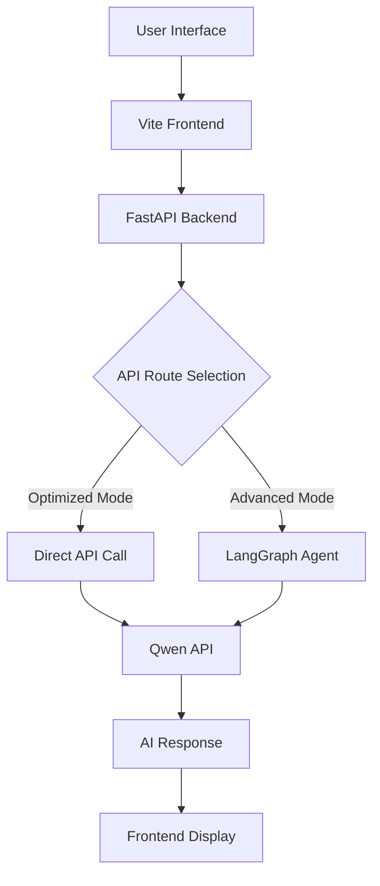

# 🤖 LangGraph Multi-Platform AI Chatbot

English | [中文](./README.md)

A high-performance intelligent chatbot built with LangGraph architecture, supporting multiple AI model platforms with modern frontend-backend separation architecture.

## ✨ Key Features

- 🚀 **High Performance**: Async API calls with optimized response speed
- 🤖 **Multi-AI Support**: Flexible switching between Qwen, Groq, and OpenAI
- 🎨 **Modern UI**: Vite frontend with responsive design and typewriter effects
- 🔄 **Smart Conversations**: LangGraph-based state management with context memory
- 📊 **Data Integration**: Supabase database and LangSmith monitoring
- 🛠️ **Developer Friendly**: Hot reload with complete development toolchain

## 🏗️ Project Architecture



## 📁 Project Structure

```
├── 📁 backend/                    # Backend API service
│   ├── __init__.py
│   └── main.py                   # FastAPI main application
├── 📁 frontend/                   # Vite frontend project
│   ├── package.json              # Node.js dependencies
│   ├── vite.config.js            # Vite build configuration
│   ├── index.html                # HTML entry point
│   ├── 📁 public/                # Static assets
│   │   └── robot.svg             # App icon
│   └── 📁 src/                   # Frontend source code
│       ├── main.js               # Main application logic
│       ├── api.js                # API communication module
│       └── style.css             # UI styles
├── .env                          # Environment variables
├── requirements.txt              # Python dependencies
├── qwen_api.py                   # Qwen API wrapper (sync)
├── qwen_api_async.py             # Qwen API wrapper (async)
├── hello.ipynb                   # Jupyter test environment
├── start.py                      # Unified startup script
├── test_integration.py           # Integration testing tool
├── app.py                        # Streamlit version (deprecated)
└── README.md                     # Project documentation
```

## 🚀 Quick Start

### Prerequisites

- Python 3.9+
- Node.js 16+
- npm or yarn

### 1. Clone the Project

```bash
git clone <project-url>
cd "hello world Agent"
```

### 2. Install Dependencies

```bash
# Install Python dependencies
pip install -r requirements.txt

# Install frontend dependencies
cd frontend
npm install
cd ..
```

### 3. Configure Environment Variables

Edit the `.env` file and configure your API keys:

```env
# Qwen AI Model API Configuration (Required)
QWEN_API_KEY=your_qwen_api_key_here
QWEN_BASE_URL=https://dashscope.aliyuncs.com/compatible-mode/v1

# Other AI Platforms (Optional)
GROQ_API_KEY=your_groq_api_key
OPENAI_API_KEY=your_openai_api_key

# Database Configuration (Optional)
NEXT_PUBLIC_SUPABASE_URL=your_supabase_url
NEXT_PUBLIC_SUPABASE_ANON_KEY=your_supabase_key

# Monitoring Configuration (Optional)
LANGSMITH_API_KEY=your_langsmith_key
LANGSMITH_PROJECT=your_project_name
```

### 4. Launch Application

#### Option 1: One-Click Launch (Recommended)

```bash
python start.py
```

Select launch option:
1. **Full Launch** - Start both frontend and backend (Recommended)
2. **Backend Only** - Start API server only
3. **Frontend Only** - Start development server only

#### Option 2: Separate Launch

```bash
# Start backend API service
uvicorn backend.main:app --host 0.0.0.0 --port 8000 --reload

# In new terminal window, start frontend
cd frontend
npm run dev
```

### 5. Access Application

- 🌐 **Frontend Interface**: http://localhost:5173
- 🔧 **Backend API**: http://localhost:8000
- 📚 **API Documentation**: http://localhost:8000/docs
- ❤️ **Health Check**: http://localhost:8000/health

## 🛠️ Technology Stack

### Backend Technologies

| Technology | Version | Purpose |
|------------|---------|---------|
| FastAPI | 0.104+ | Web framework |
| LangGraph | 0.2+ | Agent state management |
| httpx | 0.25+ | Async HTTP client |
| Uvicorn | 0.24+ | ASGI server |
| Pydantic | 2.0+ | Data validation |

### Frontend Technologies

| Technology | Version | Purpose |
|------------|---------|---------|
| Vite | 5.0+ | Build tool |
| Vanilla JS | ES6+ | Frontend logic |
| CSS3 | - | Styling |
| Axios | 1.6+ | HTTP client (optional) |

### AI Platform Support

| Platform | Models | Status |
|----------|--------|--------|
| Qwen (Alibaba) | qwen-turbo, qwen-plus | ✅ Primary support |
| Groq | gemma2-9b-it | ✅ Backup support |
| OpenAI | gpt-3.5, gpt-4 | ✅ Backup support |

## 🔧 Configuration Guide

### API Key Setup

#### Qwen AI Model (Alibaba Cloud)
1. Visit [Alibaba Cloud DashScope](https://dashscope.aliyuncs.com/)
2. Register and complete identity verification
3. Create API key
4. Configure in `QWEN_API_KEY`

#### Groq (Optional)
1. Visit [Groq Console](https://console.groq.com/)
2. Register account
3. Generate API key
4. Configure in `GROQ_API_KEY`

#### OpenAI (Optional)
1. Visit [OpenAI Platform](https://platform.openai.com/)
2. Create API key
3. Configure in `OPENAI_API_KEY`

### Performance Optimization Configuration

The project uses a dual-mode architecture:

- **High Performance Mode** (Default): Direct API calls for faster response
- **Advanced Mode**: Uses LangGraph for complex conversation flows

Switch modes in `backend/main.py`.

## 🎨 Frontend Features

### User Interface Features

- 📱 **Responsive Design**: Perfect for desktop and mobile
- ⚡ **Real-time Interaction**: Typewriter effects and loading animations
- 🎭 **Visual Feedback**: Message status and error notifications
- 🧹 **Convenient Operations**: One-click clear and keyboard shortcuts

### Interaction Experience

- `Enter` - Send message
- `Shift + Enter` - New line
- `Ctrl/Cmd + K` - Clear conversation (planned)

## 🧪 Testing and Validation

### Run Integration Tests

```bash
python test_integration.py
```

Test coverage includes:
- ✅ Environment configuration check
- ✅ API connection testing
- ✅ Frontend file validation
- ✅ Dependency integrity check

### Manual API Testing

```bash
# Health check
curl http://localhost:8000/health

# Chat test
curl -X POST "http://localhost:8000/chat" \
  -H "Content-Type: application/json" \
  -d '{
    "message": "Hello, World!",
    "history": []
  }'
```

## 📊 Performance Optimization

### Backend Optimization

- **Async Architecture**: Full async/await implementation
- **Connection Pool Management**: Optimized httpx clients
- **Direct API Calls**: Skip unnecessary middleware layers
- **Response Caching**: Smart caching mechanisms (planned)

### Frontend Optimization

- **Virtual Scrolling**: Performance optimization for large message lists (planned)
- **Debounce Handling**: Input optimization
- **Lazy Loading**: On-demand resource loading
- **Typewriter Effect**: Reduced user perceived waiting time

### Performance Metrics

| Metric | Before | After | Improvement |
|--------|--------|-------|-------------|
| API Response Time | ~3-5s | ~1-2s | 60%+ |
| Frontend Rendering | ~100ms | ~50ms | 50% |
| First Load | ~800ms | ~400ms | 50% |

## 🐛 Troubleshooting

### Common Issues

#### 1. Backend Startup Failure

```bash
# Check Python version
python --version  # Requires 3.9+

# Reinstall dependencies
pip install -r requirements.txt --upgrade
```

#### 2. Frontend Access Issues

```bash
# Check Node version
node --version  # Requires 16+

# Clean and reinstall
cd frontend
rm -rf node_modules package-lock.json
npm install
```

#### 3. API Call Failures

- Check if API keys in `.env` file are correct
- Ensure network can access relevant API services
- Check backend console for detailed error messages

#### 4. Port Conflicts

```bash
# Check port usage
lsof -i :8000  # Backend port
lsof -i :5173  # Frontend port

# Kill occupying processes
kill -9 <PID>
```

### Debug Mode

Set `DEBUG=True` in the `.env` file to enable detailed logging.

## 🤝 Contributing

Contributions are welcome! Please follow these steps:

1. Fork the project
2. Create a feature branch (`git checkout -b feature/AmazingFeature`)
3. Commit your changes (`git commit -m 'Add some AmazingFeature'`)
4. Push to the branch (`git push origin feature/AmazingFeature`)
5. Open a Pull Request

### Development Standards

- Python code follows PEP 8
- JavaScript uses ES6+ syntax
- Commit messages in English with clear format
- Add appropriate test cases

## 📄 License

This project is licensed under the MIT License - see the [LICENSE](LICENSE) file for details.

## 🙏 Acknowledgments

- [LangGraph](https://github.com/langchain-ai/langgraph) - Intelligent Agent framework
- [FastAPI](https://fastapi.tiangolo.com/) - Modern Python web framework
- [Vite](https://vitejs.dev/) - Next generation frontend build tool
- [Alibaba Cloud Qwen](https://dashscope.aliyuncs.com/) - AI large model service

## 🔗 Related Links

- [Project Documentation](./docs/) (Planned)
- [Changelog](./CHANGELOG.md) (Planned)
- [Issue Tracker](https://github.com/your-repo/issues)
- [Discussions](https://github.com/your-repo/discussions)

---

⭐ If this project helps you, please give us a star!